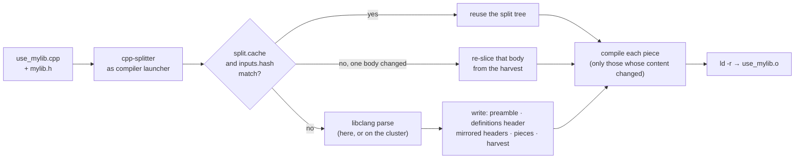
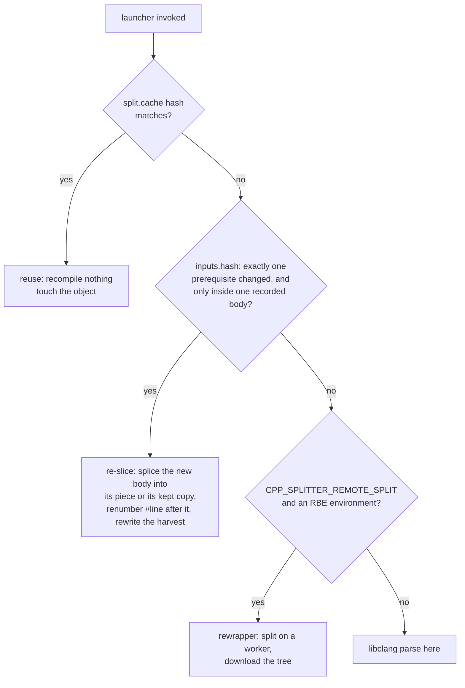
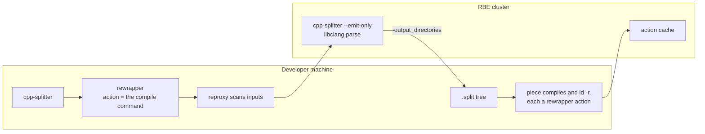

# cpp-splitter: architecture

`cpp-splitter` is a `CMAKE_CXX_COMPILER_LAUNCHER`. The build system invokes it in place of the
compiler; it parses the translation unit once with libclang, writes one `.cpp` per function
definition, compiles those pieces, and joins their objects with `ld -r` into the object the
build asked for. This document describes each transformation on `test/use_mylib.cpp`, the
fixture behind `split.use_mylib`, and records in a 💡 block after each section which measurements
and failures led to the current form, with the commits.



## 1. The input

```cpp
// mylib.h
#pragma once
#include <string>
#include <vector>
#include <numeric>
#include <algorithm>

inline int add(int a, int b) { return a + b; }
inline int multiply(int a, int b) { return a * b; }
inline std::string greet(const std::string& name) { return "Hello, " + name + "!"; }
inline double average(const std::vector<double>& values) { /* ... */ }

template<typename T>
T max_of(T a, T b) { return (a > b) ? a : b; }
```

```cpp
// use_mylib.cpp
#include "mylib.h"
#include <iostream>

int main() {
    std::cout << add(3, 4) << multiply(5, 6) << greet("World") << average({1.0, 2.0}) << max_of(10, 20);
    return 0;
}
```

The build system runs `cpp-splitter clang++ -I. -MD -MF use_mylib.o.d -c -o use_mylib.o
use_mylib.cpp`. The tool leaves `use_mylib.o` at that path and writes everything else under
`use_mylib.o.split/`:

```
use_mylib.o.split/
├── use_mylib.cpp_prefix.h                 the unit's include directives
├── use_mylib.cpp_prefix.h.pch/<hash>.pch  libclang PCH of them, for the parse
├── use_mylib_preamble.h                   declarations + vague-linkage definitions
├── use_mylib_preamble.h.gch/<hash>.gch    clang PCH of it, for the pieces
├── use_mylib.cpp_definitions.h            definitions that may exist in one object only
├── use_mylib.cpp_0_definitions.cpp        the one piece that includes them
├── use_mylib.cpp.harvest / .keeps         what was moved, what was kept, and why
├── include/mylib.h                        rewritten copy: bodies replaced by declarations
├── include/mylib.h.split / .harvest / .keeps
├── include/mylib.h_1_add.cpp … _4_average.cpp   one piece per split definition
├── split.cache · inputs.hash · depfile.cache      what this split was computed from
└── *.o                                    one object per piece
```

## 2. The parse

The include directives at the top of the unit are copied to `use_mylib.cpp_prefix.h` and
compiled to a libclang PCH named by the content hash of that file plus a `.deps` list of the
headers it reached. libclang then parses `use_mylib.cpp` once against that PCH. The parse
yields, per file the unit read: every function and variable definition with its byte extent,
its enclosing conditionals and namespaces, and whether the unit emits it; and the list of
included files from `clang_getInclusions()`.

> 💡 **Rationale.** The first versions parsed the unit without a PCH and re-parsed on every
> invocation; on Boost.Filesystem an incremental build compiled nothing and its entire cost
> was re-parsing three units with libclang (`bb80614c`). A libclang PCH of the include prefix was added in `595d66a6` and keyed on
> content rather than timestamp in `b03d1743`. Feeding the pieces' preamble PCH into the
> unit's own parse produced an AST that did not match the source; the two PCHs were separated
> in `e0b8c9e5`. A header edited behind an unchanged prefix left the PCH stale and every
> affected parse failed with `CXError_ASTReadError`, so the PCH records what it was built from
> and is rebuilt when any of that is newer (`c620c206`). A split server that kept ASTs
> resident was removed in `19416e05` once the PCH made it unnecessary.

## 3. Classification

Each definition is either split into a piece or kept where it is. Kept, with the reason
written to `<file>.keeps`:

| reason | example in the fixture |
|---|---|
| the program's entry point | `main()` |
| function template, or member of a class template | `max_of<T>` |
| virtual, constructor, destructor, conversion operator | — |
| internal linkage defined in a header | — |
| not emitted by this translation unit | — |
| a macro the file later `#undef`s is needed by the body | — |
| the definition's extent is shared with another declaration in one macro invocation | — |

The fixture's `.keeps` files:

```
use_mylib.cpp.keeps:   1  4   the program's entry point   int main()
include/mylib.h.keeps: 5  25  function template           T max_of(T, T)
```

Whether the unit emits a definition is decided from the parse: a definition is emitted if it
is reachable from something with external linkage the unit defines, or is itself such a
thing.

> 💡 **Rationale.** Boost.Filesystem's library is built with `-DBOOST_FILESYSTEM_SOURCE`,
> under which a block of inline forwarders is declared and never defined. Splitting them into
> pieces marked `__attribute__((used))` turned declarations the build never wanted into
> references nothing resolved: 19 undefined symbols at link. Splitting only what the unit
> would emit (`ca0078ba`, `ef4288bb`) is what made the library link. Templates cannot be
> instantiated ahead of time and stay in place; virtuals, constructors and destructors stay
> because moving them out of line strips `override` and member-initialiser lists that are
> usually macros (`36b96200`, `f9918e38`). `main` was split until `a5390c07`. Internal-linkage
> definitions in a header were split until `eb9642c6`; each piece would have had its own copy.
> A definition under a `#define … #undef` pair cannot be moved because the piece includes the
> whole header first and the `#undef` has already run (`372cc850`). Definitions produced by one
> macro expansion move as a whole invocation or not at all (`e42ae768`, `182d4e1e`).

## 4. The preamble, in two layers

`use_mylib_preamble.h` is the unit with its bodies removed: includes, then a declaration for
every split definition.

```cpp
#pragma once
#include "mylib.h"
#include <iostream>

int main();
```

It is compiled once to `use_mylib_preamble.h.gch/<hash>.gch`. Every piece includes it by
name; clang finds the `.gch` directory next to the header and uses the matching PCH.

Definitions that may exist in only one object — `main` here; any non-inline definition with
external linkage that is kept — go to `use_mylib.cpp_definitions.h`, which exactly one piece
includes:

```cpp
// use_mylib.cpp_definitions.h
#pragma once
#include "use_mylib_preamble.h"

int main() { /* body verbatim */ }
```

```cpp
// use_mylib.cpp_0_definitions.cpp
#include "use_mylib.cpp_definitions.h"
```

> 💡 **Rationale.** With one preamble, 50 pieces of a unit that included Boost each re-parsed
> Boost: the parallel build was slower than the serial one it replaced. The `.gch` was added in
> `5cd3b642` and named by content hash in `b03d1743`, so the same preamble is compiled once
> and never judged stale by a clock. The second layer came from `filesystem_error`'s virtual
> destructor: kept in the preamble and non-inline with external linkage, it was emitted by
> every piece — `multiple definition of filesystem_error::~filesystem_error()`. Layering the
> preamble by linkage (`99a3847c`) took Boost.Filesystem from 3 of 12 units linking to 12 of
> 12. Variables followed the same rule in `7fe712ac`; from C++17 a namespace-scope variable is
> instead kept in place and marked `inline` (`22711366`, `3decf3fa`).

## 5. Headers: mirrored copies and their pieces

`mylib.h` is included by the unit and defines functions the unit emits, so it is split too.
Its rewritten copy is written at `include/mylib.h` — the path it was included as, under the
split directory's own include root — with each split body replaced by a declaration and the
kept template left in place:

```cpp
// include/mylib.h
#pragma once
#include <string>
#include <vector>
#include <numeric>
#include <algorithm>

int add(int a, int b);
int multiply(int a, int b);
std::string greet(const std::string& name);
double average(const std::vector<double>& values);

template<typename T>
T max_of(T a, T b) { return (a > b) ? a : b; }
```

`include/mylib.h.split` names the original and the four pieces produced from it. Each piece
includes the **unit's** preamble first, then the rewritten header, then carries the
definition with `__attribute__((used))` and a `#line` directive back to the original:

```cpp
// include/mylib.h_1_add.cpp
#include "use_mylib_preamble.h"
#include "mylib.h"

__attribute__((used))
#line 7 "/…/mylib.h"
inline int add(int a, int b) {
    return a + b;
}
```

The pieces are compiled with `-I<split>/ -I<split>/include` ahead of the project's own
include directories, so `#include "mylib.h"` resolves to the rewritten copy.

> 💡 **Rationale.** In the fixture, four of the five definitions the unit emits are in
> `mylib.h`, not in `use_mylib.cpp`; on the Boost corpora the ratio is higher. Following `clang_getInclusions()` and splitting project headers, not system ones, came in
> `86e69891`. Compiling a header's piece against only that header failed on
> `boost/system/detail/std_category_impl.hpp`, which is written to be included after
> `error_condition` is complete; the piece includes its includer's preamble first
> (`37d1879a`). Split headers were first written flat by basename; Boost has two
> `atomic_ref.hpp`, one shadowed the other for every consumer, and the copy moved to the
> included path (`7b2a7052`). The split include root was appended after the project's `-I`
> flags, so an original header won over its rewritten copy and brought the moved definitions
> back: 1008 `redefinition` errors. It now comes first. A quoted include inside a rewritten
> header resolved relative to the mirror, where the sibling did not exist (`9b542e03`).
> `inline` is inserted where the original lacks it, and `__attribute__((used))` forces the
> symbol, because a piece for an inline function otherwise emitted nothing (`e1716026`);
> `always_inline` is dropped when re-emitting (`da84892d`).

## 6. Members, and preprocessor context

A member defined in its class is emitted out of line with a trailing return type, and the
class keeps a declaration in its place. From `test/member_functions.cpp`:

```cpp
// in the class                                    // the piece
int value() const { return value_; }               namespace demo {
                                                   #line 22 "/…/member_functions.cpp"
// in the preamble                                 auto Widget::value() const -> int { return value_; }
int value() const;                                 }
```

A definition inside `#if` blocks is emitted inside the same blocks. From Boost.Filesystem:

```cpp
#include "portability_preamble.h"
#include "path.hpp"
#if !defined(BOOST_NO_CXX17_HDR_STRING_VIEW)
namespace boost { namespace filesystem {
inline path::path(std::basic_string_view<value_type> const& s) : m_pathname(s) {}
} }
#endif
```

The file's own include guard is excluded — its macro is defined by the time the piece
compiles — and `#elif C` becomes `#if C`, since a piece opens its own conditional.

> 💡 **Rationale.** A member carved out verbatim is not valid outside its class: `const` is
> ill-formed on a non-member and a constructor's initialiser list parses as a base-initialiser.
> `f9918e38` emits members out of line. A leading return type is looked up in the enclosing
> namespace once out of line, so class-scoped names such as `iterator` stopped resolving; the
> trailing form is looked up in class scope. Conditionals were replayed after a definition
> inside `#if !defined(BOOST_NO_CXX17_HDR_STRING_VIEW)` was emitted unconditionally and
> referred to a type that did not exist (`2f1b9b65` covers the case where the condition is no
> longer true once the header is included in the piece). Multi-line conditionals and a
> `//` comment on the declarator's last line each had a fixture and a fix (`test/`).

## 7. Reuse and re-slice

After a split, three records are written beside the pieces:

- `depfile.cache` — the compiler's `-MF` output, rewritten so that each rewritten header copy
  is followed by the original it came from; the build system receives the same list.
- `inputs.hash` — the content hash of every prerequisite in it.
- `split.cache` — a hash over the source, the flags and every prerequisite's content, plus the
  list of files the split produced.
- `<file>.harvest` — for each file, every definition's byte extent, the offset of its body,
  hashes of the body and of the signature, hashes of the gaps between definitions, and the
  piece that carries it (`-` if kept).

On the next invocation the launcher takes the first of these that applies:



A re-slice writes exactly what a full split would write for the same edit; the test
`launcher.incremental_body_edit` hashes every generated file after a re-slice and after a
forced full split of the same edit and requires the two sets to be equal.

> 💡 **Rationale.** A build system re-runs the launcher whenever a prerequisite's timestamp
> moves, and each run re-parsed: a `touch` of one header re-parsed every unit that included it
> to produce byte-identical output. Hashing the split's inputs (`262eb53d`) made that a
> comparison. The depfile named the rewritten copies, so an edit to a real header rebuilt
> nothing until `94018fb3` mapped them back. With reuse in place, an edit to one body still
> re-parsed every affected unit; on Boost.Geometry the parse was measured as the whole cost of
> that row (`2446bca4`), and `71cc0b23` added the re-slice. It applied only to definitions the
> unit had emitted a piece for; a definition the unit keeps in its header copy fell inside a
> gap and the edit read as a change outside every definition. On Boost.Spirit that was 267 of
> 268 units re-splitting (`8c434275`, `3044a13b`).

## 8. The link

The pieces' objects are joined with `ld -r -o use_mylib.o <pieces>`. When the splitter runs
behind `tipi-compiler-driver`, the link is handed to `tipi-linker-driver` and becomes a cached
action like the compiles. `CPP_SPLITTER_LINKER` selects `ld`, `mold` or `ld.lld`; all three
take `-r`.

> 💡 **Rationale.** `ld -r` produces an ordinary object, so nothing downstream of the launcher
> changes (`16d589c2`). Benchmarked in `684734e1`; `mold` allowed in `ad90bca3`. When the object
> was up to date the link was skipped and the object left older than its inputs, so the build
> system rebuilt it every time; `d2663f98` touches it. The link joined the distributed build in
> `a13ae165`, with ~800 cache hits on Boost.Spirit where 193 units relinked identically.

## 9. Producing the split on the cluster

With `CPP_SPLITTER_REMOTE_SPLIT=1` and reproxy's environment present, the launcher invokes
`rewrapper` with the unit's compile command as the action and itself as `-remote_wrapper`,
labelled `type=compile` so that reproxy's C++ input processor determines and uploads the
header closure. The worker runs the same binary, staged into the exec root by content hash,
with `CPP_SPLITTER_EMIT_ONLY=1`: it parses, writes the split tree, and exits. The tree returns
through `-output_directories`; compiling and linking proceed as above.



> 💡 **Rationale.** On Boost.Spirit's suite at `-j500` the parses, not the compiles, were what
> the machine ran out of. TODO/35 (`9f4c819c`) moved the parse; `c7077971` implements it. Four
> details each cost a debugging round: `-remote_wrapper` is resolved relative to the working
> directory while `-toolchain_inputs` is relative to the exec root; the binary must lie under
> the exec root to be uploaded; EngFlow refuses an action without a platform; and
> `-labels=type=compile` is what makes reproxy scan the command for inputs (`16984b35`).
> reclient merges `-output_directories` into an existing directory rather than replacing it,
> and `read_split_cache()` appended to a populated result, so a second split over a populated
> directory listed every piece twice at `ld -r`; both fixed in `cf7b97e3`. The re-slice is
> tried before the remote split (`51409dd4`): a needless remote split is a round trip per unit
> and regenerates every piece's action key. Measured in
> `benchmarks/boost-spirit-rbe-summary-9-Sep-2026.md`: the body edit executes one compile
> with 268 units re-slicing locally; the cold build's remaining cost is transferring the split
> trees back, not parsing.
