# One function changed, one function compiled — even when the parse is on another machine

`cpp-splitter` is a `CMAKE_CXX_COMPILER_LAUNCHER`. It takes a C++ translation unit, cuts it into
one object file per function, compiles the pieces, and links them back with `ld -r`. The build
system sees the object it asked for. The point is what happens next: when you change one
function body, only the piece holding it is recompiled.

This post is what that does to Boost.Spirit's own test suite — all **277** programs its
Jamfiles declare, header-only, expression-template dense, each pulling in most of Boost —
first with the split done on the developer's machine, then with the split itself pushed onto a
build farm. Full numbers, machine, and every caveat are in
[`benchmarks/boost-spirit-rbe-summary-9-Sep-2026.md`](benchmarks/boost-spirit-rbe-summary-9-Sep-2026.md).

## The edit

One line inside the body of `standard_wide::toucs4()`, an ordinary function in a header that
**194 units include and exactly one emits**. That asymmetry is the whole test. A plain build
has to recompile everything that includes the header. A split build only has to recompile the
piece whose body moved.

Measured through CMake RE against an EngFlow RBE cluster at `-j500`, Release:

| build | wall | compiles executed on the cluster | what the affected units did |
|---|---:|---:|---|
| plain | 136.2s | **271** | recompiled whole |
| split, here | 74.9s | **1** | re-ran the launcher; 1 piece changed, 1575 cache hits for the rest |
| split, on the cluster | **22.6s** | **1** | **268 re-sliced the body locally, no parse anywhere** |

The plain build genuinely recompiles 271 units: a content change gives every one of them a new
action key and nothing can come from cache. The split build compiles **one** thing.

## Why push the split to the cluster at all

Splitting a unit means parsing it with libclang, and the launcher holds that AST alongside
everything else. On this corpus the parses, not the compiles, are what runs the machine out of
memory at high job counts — an earlier version of this benchmark had to run at `-j8` on a 32-core
box for exactly that reason.

So the launcher can now shell itself out through `rewrapper` before parsing anything. The split
becomes one remote action per unit; reproxy's own C++ input processor scans the compile command
and uploads the header closure, the worker writes the split tree, and it comes back with
`-output_directories`. The pieces still compile as separate actions and the final `ld -r` still
happens here. The parse is the only thing that moves.

What one translation unit goes through, end to end:

```mermaid
flowchart LR
    subgraph local["Developer machine"]
        direction TB
        src["unit.cpp + the headers it includes"]
        edge["cmake-re --distributed<br/>ninja edge for unit.o"]
        launcher["cpp-splitter, chained ahead of tipi-compiler-driver<br/>CPP_SPLITTER_REMOTE_SPLIT=1"]
        rw1["rewrapper<br/>action = the compile command<br/>-remote_wrapper = cpp-splitter"]
        reproxy["reproxy<br/>C++ input processor scans the command<br/>and uploads the header closure"]
        tree[".split tree comes back<br/>one .cpp per function · preamble · harvest"]
        driver["tipi-compiler-driver<br/>one compile per piece"]
        rw2["rewrapper × N<br/>inputs scanned per piece"]
        link["ld -r → unit.o<br/>the object the build asked for"]
    end
    subgraph cluster["EngFlow RBE cluster"]
        direction TB
        worker["worker · cpp-splitter --emit-only<br/>libclang parses the unit once<br/>writes the split, compiles nothing"]
        cache["action cache<br/>keyed on content"]
        compile["workers × N<br/>clang++ -c piece.cpp"]
    end
    src --> edge --> launcher --> rw1 --> reproxy
    reproxy -- "inputs" --> worker
    worker -- "-output_directories" --> tree
    tree --> driver --> rw2 --> cache
    cache -- "hit: object served" --> link
    cache -- "miss" --> compile --> link
```

The split action is labelled `type=compile`, so reproxy treats it exactly like a compile: it
works out the inputs itself and nothing has to declare them. The worker runs the same
`cpp-splitter` binary, staged into the exec root by content hash, with `--emit-only` telling it
to write the split tree and stop. Everything after the tree comes back is the ordinary
distributed build — each piece is an action of its own, and an edit that changes one piece
changes one action key.

**A cold full build** of all 277 programs, split on the cluster, took **334.6s** with all 279
splits executed remotely and nothing falling back — against 456.0s for the same split produced
locally, and that row was served entirely from cache. A row that did the parsing beat one that
did none. It is still a modest win, and the EngFlow profile says where the rest of the time goes:
279 remote splits at a mean of 28.9s of worker time, and **589,911 blob downloads** to bring
the pieces home. The parse leaves the machine; the output transfer replaces it. Compiling the
pieces where they already are is the obvious next step.

## The row that only worked once the fast path did

The 22.6s did not appear on the first try. The first measurement of that row read **606.5s and
4835 remote actions** — worse than the plain build.

The splitter's own log said why, once it was asked: of the 268 affected units, 267 went back to
the cluster for a full split, 265 of them refusing to re-slice with *"the changed file
contributed no split-out definition"*. A unit that includes
the header but never calls `toucs4()` **keeps** the definition in its rewritten copy of the
header rather than emitting a piece, and kept definitions had been left out of the harvest that
the re-slice works from. Every such unit re-split from scratch — on the cluster, once per unit,
regenerating every piece it owned.

It was reproduced in a 0.6s local test, fixed by recording kept definitions with no piece and
patching the header copy instead, and it turned out not to be about remote splitting at all —
the same refusal happens with a purely local split. Remote execution just made the cost visible:
locally, a needless re-parse produces byte-identical pieces and the cache absorbs it; on a
cluster, a needless re-split is a round trip.

## The costs, in the same breath

- **A full build is far more work.** 456.0s to split locally against 32.1s plain when both are
  served from cache — the standing cost of carrying 9.7× more actions. Pushing the split to the
  cluster brings that to 334.6s, not to parity.
- **Remote splitting does not reduce memory here.** Peak resident memory on the full row was
  7.0G with the split on the cluster against 2.9G splitting locally: the launchers stay resident
  waiting on the cluster, and the downloads are not free. That half of the motivation is not
  supported by this evidence.
- **Wall times move run to run.** The same body row re-measured an hour later, timed on the
  build phase alone, read 33.0s. The action counts — 271 against 1 — are the stable part of the
  result, and they are the part the design is about.
- **Disk.** A split tree for this suite runs to tens of gigabytes against tens of megabytes.
  Nothing here addresses that.

## Summary

Per-function splitting makes the work an edit causes proportional to what the edit changed,
not to the file it was written in: **one compile instead of 271** for a one-line change, and
**22.6s instead of 136.2s** on a build farm. Producing the split on the farm as well keeps that
result while taking the parse — the part that exhausts a developer machine — off it entirely,
at a modest cost to the cold build and, for now, no saving in memory.

What is still missing is the corpus where the argument should be strongest: a few enormous
translation units, where a plain build is pinned to one long pole and a split build is not.
Spirit's tests are 277 small ones. They were chosen to be hostile, and they were.
