# Splitting Boost.Spirit's test suite per function, locally and on a build farm

`cpp-splitter` is a `CMAKE_CXX_COMPILER_LAUNCHER`. It parses a C++ translation unit with
libclang, writes one `.cpp` per function definition, compiles those pieces, and links them back
into the object the build system asked for with `ld -r`. When a function body changes, only the
piece containing it is recompiled.

This post reports its effect on Boost.Spirit's test suite: the 277 programs the Jamfiles of
`qi`, `karma`, `lex`, `x3` and `support` declare, built with CMake RE against an EngFlow RBE
cluster at `-j500`, in Release. Two configurations are compared with a plain build: the split
produced on the developer machine, and the split produced on the cluster. All numbers, the
machine, and the caveats are in
[`benchmarks/boost-spirit-rbe-summary-9-Sep-2026.md`](benchmarks/boost-spirit-rbe-summary-9-Sep-2026.md).

## The edit

The scenario changes one line in the body of `standard_wide::toucs4()`, a non-template
function in a header. 194 of the 277 units include that header; one of them emits the
function. A plain build must recompile every unit that includes the header. A split build must
recompile the one piece whose content changed.

| build | wall | compiles executed on the cluster | what the affected units did |
|---|---:|---:|---|
| plain | 136.2s | 271 | recompiled whole |
| split, produced locally | 74.9s | 1 | launcher re-ran on each; 1 piece recompiled, 1575 cache hits |
| split, produced on the cluster | 22.6s | 1 | 268 units re-sliced the body locally; no parse on either side |

The plain build executes 271 compiles because the content change gives every affected unit a
new action key. Both split builds execute one.

## Producing the split on the cluster

Splitting a unit requires a libclang parse, and the launcher holds that AST in memory for the
duration. On this corpus the parses, not the compiles, are what limits the job count on the
developer machine: an earlier version of this benchmark ran at `-j8` on a 32-core, 122 GiB
machine because `-j32` ran out of memory.

With `CPP_SPLITTER_REMOTE_SPLIT=1` the launcher invokes `rewrapper` before parsing, with the
unit's compile command as the action and itself as `-remote_wrapper`. The action is labelled
`type=compile`, so reproxy's C++ input processor determines the header closure and uploads it;
nothing declares the inputs by hand. The worker runs the same `cpp-splitter` binary, staged into
the exec root by content hash, with `--emit-only`: it parses, writes the split tree, and exits
without compiling. The tree returns through `-output_directories`. Each piece is then compiled
as a separate action through `tipi-compiler-driver`, and the `ld -r` that joins them goes
through `tipi-linker-driver` as one more action.

```mermaid
flowchart LR
    subgraph local["Developer machine"]
        direction TB
        src["unit.cpp + the headers it includes"]
        edge["cmake-re --distributed<br/>ninja edge for unit.o"]
        launcher["cpp-splitter, chained ahead of tipi-compiler-driver<br/>CPP_SPLITTER_REMOTE_SPLIT=1"]
        rw1["rewrapper<br/>action = the compile command<br/>-remote_wrapper = cpp-splitter"]
        reproxy["reproxy<br/>C++ input processor scans the command<br/>and uploads the header closure"]
        tree[".split tree comes back<br/>one .cpp per function · preamble · harvest"]
        driver["tipi-compiler-driver<br/>one compile per piece"]
        rw2["rewrapper × N<br/>inputs scanned per piece"]
        linker["tipi-linker-driver → rewrapper<br/>the relocatable link as one more action"]
        obj["unit.o<br/>the object the build asked for"]
    end
    subgraph cluster["EngFlow RBE cluster"]
        direction TB
        worker["worker · cpp-splitter --emit-only<br/>libclang parses the unit once<br/>writes the split, compiles nothing"]
        cache["action cache<br/>keyed on content"]
        compile["workers × N<br/>clang++ -c piece.cpp"]
        link["worker · ld -r<br/>joins the pieces into unit.o"]
    end
    src --> edge --> launcher --> rw1 --> reproxy
    reproxy -- "inputs" --> worker
    worker -- "-output_directories" --> tree
    tree --> driver --> rw2 --> cache
    cache -- "hit: object served" --> linker
    cache -- "miss" --> compile --> linker
    linker -- "the pieces" --> link
    link -- "cached when none of them changed" --> obj
```

### Cold build

A full build of all 277 programs with the split produced on the cluster took 334.6s, with all
279 splits executed remotely and no fallback. The same build with the split produced locally
took 456.0s, served entirely from the action cache. The EngFlow profile of the remote-split row
gives the breakdown: 279 split actions at a mean of 28.9s of worker time each, and 589,911
blob downloads to return the pieces. Parsing has moved to the cluster; the remaining cost is
transferring the split trees back. Compiling the pieces on the workers that produced them,
instead of downloading them first, would remove that transfer and has not been done.

### The body row required a fix to the re-slice

The first measurement of the body row with the split produced on the cluster read 606.5s and
4835 remote actions. The splitter's log attributed it: of the 268 affected units, 267 re-split
on the cluster, and 265 of them refused the re-slice with the message *the changed file
contributed no split-out definition*.

The cause: a unit that includes the header but does not call `toucs4()` keeps the definition
in its rewritten copy of the header instead of emitting a piece, and kept definitions were not
recorded in the harvest that the re-slice reads. Such a unit therefore could not locate the
edit and re-split entirely, regenerating every piece it owned and giving each a new action
key.

The defect was not specific to remote splitting; the same refusal occurs with a local split.
Locally the needless re-parse produces byte-identical pieces and the cache absorbs it, so it
cost a parse per unit and nothing else. On the cluster it cost a round trip per unit. It was
reproduced in a local test that runs in 0.6s, and fixed by recording kept definitions with no
piece and patching the header copy in place. After the fix the row read 22.6s, with 268 units
re-slicing and one compile executed.

## Costs

- A full split build is more work than a plain one: 456.0s against 32.1s when both are served
  from cache, which is the overhead of 15885 actions against 1641. Producing the split on the
  cluster reduces this to 334.6s.
- Remote splitting did not reduce memory use on this machine. Peak resident memory of the
  build's own processes on the full row was 7.0G with the split produced on the cluster and
  2.9G with it produced locally. Launchers remain resident while waiting on the cluster, and the
  downloaded trees are large.
- Wall times vary between runs. The body row with the split on the cluster measured 22.6s in
  one run and 33.0s in another an hour later. The action counts (271 against 1) did not vary.
- A split build tree for this suite is tens of gigabytes, against tens of megabytes for a plain
  one. Nothing here addresses that.

## Summary

For a one-line change to a function body in a widely included header, a plain build of this
suite executes 271 compiles and takes 136.2s; a split build executes one compile and takes
74.9s with the split produced locally or 22.6s with it produced on the cluster. Producing the
split on the cluster removes the libclang parse from the developer machine at a cost of a
slower cold build than a plain one, and without reducing peak memory in this measurement.

The suite is 277 small programs. The case where per-function splitting should help most — a
few very large translation units, where a plain build is bounded by the longest one — has not
been measured.
