# Splitting Boost.Spirit's test suite per function: on one machine, on a build farm, and with the split itself on the farm

`cpp-splitter` is a `CMAKE_CXX_COMPILER_LAUNCHER`. It parses a C++ translation unit with
libclang, writes one `.cpp` per function definition, compiles those pieces, and links them back
into the object the build system asked for with `ld -r`. When a function body changes, only the
piece containing it is recompiled.

> 💡 **`ld -r`** is the linker's relocatable (partial) link mode. Instead of producing an
> executable or shared library, it combines several object files into a single object file:
> sections of the same name are concatenated, symbols are merged, and relocations are kept
> unresolved rather than applied. The output is an ordinary `.o` that a later link consumes
> exactly as it would consume one produced by a single compile. This is what lets the splitter
> stay invisible to the build system: it compiles N pieces, runs `ld -r -o unit.o piece_1.o …
> piece_N.o`, and the build sees the one `unit.o` it asked for, with the same name, in the same
> place, usable in the same archives and link lines. GNU ld, lld and mold all implement it with
> the same flag.

This post reports its effect on Boost.Spirit's test suite: the 277 programs the Jamfiles of
`qi`, `karma`, `lex`, `x3` and `support` declare, built in Release with clang 13 through CMake
RE. Three configurations are measured: on one machine, on an EngFlow RBE cluster with the split
produced locally, and on the cluster with the split produced there too. All numbers, the
machine, and the caveats are in
[`benchmarks/boost-spirit-rbe-summary-9-Sep-2026.md`](benchmarks/boost-spirit-rbe-summary-9-Sep-2026.md).

The scenario, used throughout:

- **Edit one line in the body of `standard_wide::toucs4()`, a non-template function in a header
  that 194 of the 277 units include and one emits, then rebuild.** A plain build recompiles
  every unit that includes the header; a split build recompiles the one piece whose content
  changed. Wall times are the build phase alone.

## 1. On one machine

A 32-core AMD EPYC at `-j16`, no cluster and no cache:

| scenario | plain | split | what the split build did |
|---|---:|---:|---|
| full, cold | 57.8s | 654.6s | parsed and split all 279 units |
| no-op | 5.7s | 11.4s | reused every split |
| **one body** | **57.5s** | **14.2s** | **re-sliced the body in 268 units without a parse; recompiled 1 piece** |

The cold build costs 11.3x. One object per function is more work than one object per file,
and on a single machine nothing absorbs it. The body edit is 4.0x faster: the plain build
recompiles the 194 units that include the header, and the split build patches the recorded
body in place and compiles one piece. Nothing falls back on any row.

## 2. What it means for build distribution

The same suite through CMake RE against an EngFlow RBE cluster at `-j500`, with the split still
produced on the developer machine. Reclient records where every action ran, so these rows say
how much was compiled, not only how long it took.

| build | wall | compiles executed on the cluster | cache hits |
|---|---:|---:|---:|
| plain, one body | 136.2s | 271 | 762 |
| split, one body | 74.9s | 1 | 1575 |

A content change gives every affected unit a new action key, so the plain build executes 271
compiles and nothing can be served from cache. The split build executes one: the 1575 other
pieces it needs are byte-identical to what the cluster already has. This is what a
content-addressed cache rewards, and it is the reason to split at all.

Two costs go with it. The cold full build carries 15885 actions against 1641 — 456.0s against
32.1s when both are served from cache. And the split still requires a libclang parse per unit
on the developer machine: the compiles are distributed, the parsing is not. (These two rows
were timed around the whole invocation, including about 20s of configure, before the benchmark
was changed to time the build alone; the counts are unaffected.)

## 3. Producing the split on the cluster

With `CPP_SPLITTER_REMOTE_SPLIT=1` the launcher invokes `rewrapper` before parsing, with the
unit's compile command as the action and itself as `-remote_wrapper`. The action is labelled
`type=compile`, so reproxy's C++ input processor determines the header closure and uploads it;
nothing declares the inputs by hand. The worker runs the same `cpp-splitter` binary, staged into
the exec root by content hash, with `--emit-only`: it parses, writes the split tree, and exits
without compiling. The tree returns through `-output_directories`. Each piece is then compiled
as a separate action through `tipi-compiler-driver`, and the `ld -r` that joins them goes
through `tipi-linker-driver` as one more action.

```mermaid
flowchart LR
    subgraph local["Developer machine"]
        direction TB
        src["unit.cpp + the headers it includes"]
        edge["cmake-re --distributed<br/>ninja edge for unit.o"]
        launcher["cpp-splitter, chained ahead of tipi-compiler-driver<br/>CPP_SPLITTER_REMOTE_SPLIT=1"]
        rw1["rewrapper<br/>action = the compile command<br/>-remote_wrapper = cpp-splitter"]
        reproxy["reproxy<br/>C++ input processor scans the command<br/>and uploads the header closure"]
        tree[".split tree comes back<br/>one .cpp per function · preamble · harvest"]
        driver["tipi-compiler-driver<br/>one compile per piece"]
        rw2["rewrapper × N<br/>inputs scanned per piece"]
        linker["tipi-linker-driver → rewrapper<br/>the relocatable link as one more action"]
        obj["unit.o<br/>the object the build asked for"]
    end
    subgraph cluster["EngFlow RBE cluster"]
        direction TB
        worker["worker · cpp-splitter --emit-only<br/>libclang parses the unit once<br/>writes the split, compiles nothing"]
        cache["action cache<br/>keyed on content"]
        compile["workers × N<br/>clang++ -c piece.cpp"]
        link["worker · ld -r<br/>joins the pieces into unit.o"]
    end
    src --> edge --> launcher --> rw1 --> reproxy
    reproxy -- "inputs" --> worker
    worker -- "-output_directories" --> tree
    tree --> driver --> rw2 --> cache
    cache -- "hit: object served" --> linker
    cache -- "miss" --> compile --> linker
    linker -- "the pieces" --> link
    link -- "cached when none of them changed" --> obj
```

| scenario | build | remote | cached | what the 279 units did |
|---|---:|---:|---:|---|
| full, cold | 357.5s | 0 | 16722 | all 279 split on the cluster |
| **one body** | **33.0s** | **1** | 1575 | **268 re-sliced locally; no parse on either side** |

The body edit executes one compile, as before, and no libclang parse runs anywhere: the 268
affected units patch the recorded body locally. The cold build with the split on the cluster
measured 334.6s in a run where all 279 splits executed remotely, against 456.0s for the split
produced locally. The EngFlow profile of that row gives the breakdown: 279 split actions at a
mean of 28.9s of worker time each, and 589,911 blob downloads to return the pieces. The parse
has moved to the cluster; the remaining cost is transferring the split trees back. Compiling
the pieces on the workers that produced them, instead of downloading them first, would remove
that transfer and has not been done.

### The body row required a fix to the re-slice

The first measurement of that row read 606.5s and 4835 remote actions. The splitter's log
attributed it: of the 268 affected units, 267 re-split on the cluster, 265 of them refusing the
re-slice with the message *the changed file contributed no split-out definition*.

A unit that includes the header but does not call `toucs4()` keeps the definition in its
rewritten copy of the header instead of emitting a piece, and kept definitions were not
recorded in the harvest the re-slice reads. Such a unit could not locate the edit and re-split
entirely, regenerating every piece it owned and giving each a new action key. The defect was
not specific to remote splitting: the same refusal occurs with a local split, where it cost a
parse per unit that the cache then absorbed — the 90.2s the local body row read before the fix,
against 14.2s after. On the cluster it cost a round trip per unit. It was reproduced in a local
test that runs in 0.6s and fixed by recording kept definitions with no piece and patching the
header copy in place.

## Costs

- A full split build is more work than a plain one: 11.3x on one machine, and 15885 actions
  against 1641 on the cluster. Producing the split on the cluster reduces the cold build from
  456.0s to 334.6s, not to parity.
- Wall times vary between runs. The cluster body row measured 22.6s in one run and 33.0s in
  another an hour later. The action counts (271 against 1) did not vary.
- A split build tree for this suite is tens of gigabytes, against tens of megabytes for a plain
  one. Nothing here addresses that.

## Summary

The one-line body edit, build time:

```mermaid
---
config:
  themeVariables:
    xyChart:
      plotColorPalette: '#cccccc, #8de7f9'
---
xychart
    title "One header function body edit — build time (s)"
    x-axis ["Plain (local, -j16)", "Plain (distributed, -j500)", "Split (local, -j16)", "Split (distributed, -j500)"]
    y-axis "build time (s)" 0 --> 300

    %% neutral base
    bar [57.5, 287.4, 0, 0]

    %% split builds, highlighted
    bar [-300, -300, 14.2, 33.0]
```

All four are build-phase times. The distributed plain figure is from a run of that
configuration alone, in which the row executed 271 compiles on the cluster; it is the row most
sensitive to cluster load, having read between 118s and 287s across runs while executing the
same 271 compiles.

On one machine, splitting turns a 57.5s rebuild of 194 units into a 14.2s re-slice and one
compile. On a build farm it turns 271 executed compiles into one. Producing the split on the
farm as well keeps that result and removes the libclang parse from the developer machine, at
the cost of a cold build that is slower than a plain one. The suite is 277 small programs; the
case where per-function splitting should help
most — a few very large translation units, where a plain build is bounded by the longest one —
has not been measured.
